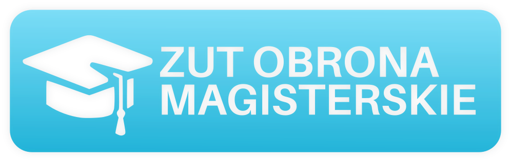

 

Pytania na obronę pracy magisterskiej WI ZUT 2021  🧑‍💻👩‍💻🏫

<table>
<tbody>
<td align="center">
 
Dokument z pytaniami: <b><a href="https://github.com/karlosos/ZUT_pytania_magisterskie/releases">Pobierz tutaj 📥</a></b> 
Pytania opracowane przez: <a href="https://github.com/karlosos">Karol Działowski</a> 

</td>
</tbody>
</table>

<!-- TODO ustawić adres -->

## Propozycje zmian

Jestem otwarty na wszelkie propozycje i poprawki. Najlepszą opcją jest stworzenie pull requesta z zmianami. Jeżeli chcesz sam rozwijać/poprawiać pytania to zachęcam do forkowania.

## Kompilacja PDF

Cała treść dokumentu jest zdefiniowana w `document.tex`. Jako kompilator wykorzystywałem `XeLaTeX` z wersją TeX Live 2020. Do stworzenia tego dokumentu sorzystałem z edytora [Overleaf](https://www.overleaf.com/).

## Lista pytań do SEO

1. Zasady cyfryzacji sygnałów. Prawo Kotielnikowa-Shannona. Granica Nyquista. Aliasing.
2. Bezpieczny schemat podpisu cyfrowego. Modele bezpieczeństwa.
3. Idea interpolacji funkcji z wykorzystaniem funkcji sklejanych.
4. Styl poznawczy (kognitywny) człowieka.
5. Korzyści wynikające z zastosowania grafowych baz danych do przetwarzania dużych zbiorów danych o strukturach grafowych.
6. Założenia i obszary zastosowania platformy Apache Spark.
7. Sposoby sprawdzania właściwości losowych danego ciągu.
8. Filtracja cyfrowa: filtry SOI i NOI.
9. Reprezentacja sygnałów za pomocą szeregów funkcyjnych. Dyskretne transformacje ortogonalne oraz szybkie algorytmy ich wyznaczania.
10. Atak na podpis cyfrowy wykorzystujący paradoks dnia urodzin.
11. Podział metod rozwiązywania równań liniowych metodami numerycznymi.
12. Algorytm numeryczny niestabilny a algorytm źle uwarunkowany.
13. Programowanie kodu wielowątkowego wraz z wzajemnym wykluczaniem w C++ 11 Threads.
14. Cechy środowiska Hadoop
15. Rodzaje błędów składające się na całkowity błąd obliczeń numerycznych.
16. Standard C++ 17 Parallel.
17. Dokładność rozwiązania równań różniczkowych metodami numerycznymi.
18. Wpływ zachowań z obszaru kognitywistyki relacji społecznych na rozwój mediów społecznościowych
19. Programowanie przenośnego kodu wielowątkowego na przykładzie PosixThreads.
20. Zastosowanie okulografii w pięciu wybranych dziedzinach życia.
1. Charakterystyka języków programowania wykorzystywanych w analizie danych.
2. Porównanie dwóch dowolnych algorytmów wykrywania obiektów.
3. Charakterystyka wybranych metod śledzenia obiektów.
4. Trzy pytania, na które odpowiadają Ukryte Modele Markowa oraz używane to tego celu algorytmy.
5. Cechy obiektów audio i metody ekstrakcji cech tych obiektów.
6. Przebieg uczenia ze wzmocnieniem i pozyskiwana w tym procesie wiedza.
7. Cechy charakterystyczne splotowych sieci neuronowych.
8. Podstawowe różnice między sygnałem mowy a sygnałem muzycznym w dziedzinie częstotliwości.
9. Metody próbkowania sieci złożonych.
10. Elementy składowe procesu klasyfikacji sygnałów akustycznych.
11. Model SVM (procedura uczenia, wariant linowy i nieliniowy, przekształcenia jądrowe).
12. Sieci perceptronowe i metody uczenia perceptronu (warianty algorytmów uczenia, głosowanie, zastosowania).
13. Proces tworzenia zbioru uczącego, walidującego I testowego w głębokim uczeniu.
14. Sposób działania algorytmów uczących AdaBoost i RealBoost.
15. Omówienie na przykładzie algorytmu Apriori odkrywania asocjacji w zbiorach danych.
16. Przykład sieci bayesowskiej (przekonań): struktura sieci, właściwości i jej interpretacja oraz uczenie.
17. Deskryptory cech niskopoziomowych – wybrane algorytmy w odniesieniu do wykorzystywanych cech.
18. Główne miary centralności w sieciach złożonych.
19. Pakiety języka Python wykorzystywane w analizie danych.
20. Techniki regularyzacji modeli klasyfikacyjnych i regresyjnych (regularyzacja L1, L2, elastic net; problemy optymalizacyjne; zastosowania).
